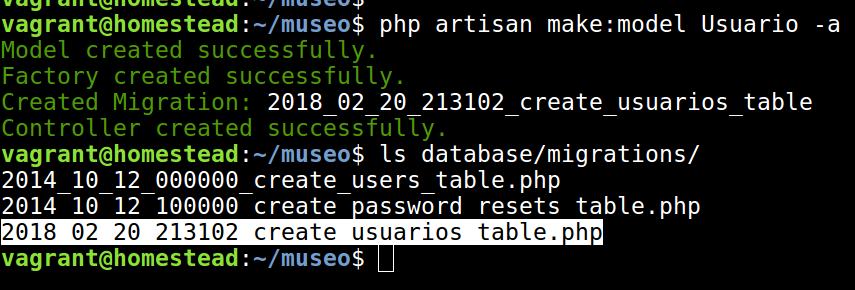
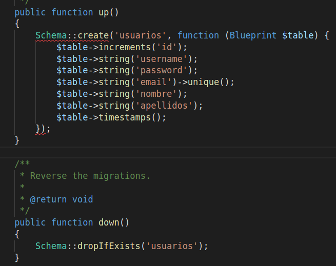

# Migraciones

Las migraciones en Laravel nos ayudan para no 
tener que lidiar con el tedioso trabajo de crear 
y/o borrar todas las tablas de la base de datos
cuando instalamos/desinstalamos la aplicación en 
nuestro servidor.

Además así también gestionamos las diferentes versiones
del esquema de la base de datos junto con las versiones
del código PHP con la lógica de la aplicación.

## Generando migraciones

Si ya has completado la [actividad de propuesta aquí.](gitClone.md), ahora vamos a crear el modelo y las migraciones de la BBDD:

Nos conectamos a la máquina virtual y entramos en el directorio Laravel del proyecto:

```
$ cd Homestead
$ vagrant ssh
vagrant@homestead:~/test$ php artisan make:model Usuario -a
 ```



Como puedes ver le pasamos como parámetro **-a** que quiere decir que genere el modelo pero que también genere la migración de la base de datos y el controlador.

Esto va a generar los ficheros:
* Usuario.php (directorio app)
* UsuarioController.php (directorio app -> Http -> Controllers)
* create_usuario_table.php (directorio database -> migrations)

Hay que modificar el fichero "create_usuario_table.php" con los campos que debe tener.



Ahora generamos las tablas en la BBDD con el comando (desde la máquina virtual y el directorio del proyecto):

```
php artisan migrate
```

## Preparando las rutas

Añadimos esta línea a nuestro fichero web.php:

```php
Route::resource('usuarios', 'UsuarioController');
```

Esto conectará *mágicamente* las siguientes rutas y verbos HTTP con el controlador 
"UsuarioController.php" antes comentado:

| Verbo | URI |	acción (Controller)	| Route 
| --- | --- | --- | --- | ---
| GET |	/Usuario |	index |	users.index
| GET |	/Usuario/create	| create | users.create
| POST |	/Usuario	| 	store	| 	users.store
| GET |	/Usuario/{id}	| 	show	| 	users.show
| GET |	/Usuario/{id}/edit	| 	edit	| 	users.edit
| PUT/PATCH |	/Usuario/{id}	| 	update	| 	users.update
| DELETE |	/Usuario/{id}		| destroy	| 	users.destroy

Ahora toca configurar cada una de esas rutas, que serán métodos en el fichero UsuarioController.php y para ello tendremos que conocer cómo trabajar con el modelo
y cómo recuperar datos de la BBDD.

Siguiente [paso: CRUD desde el controlador.](model.md)